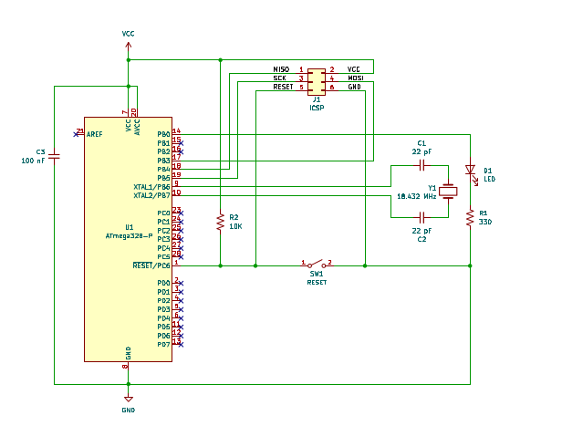
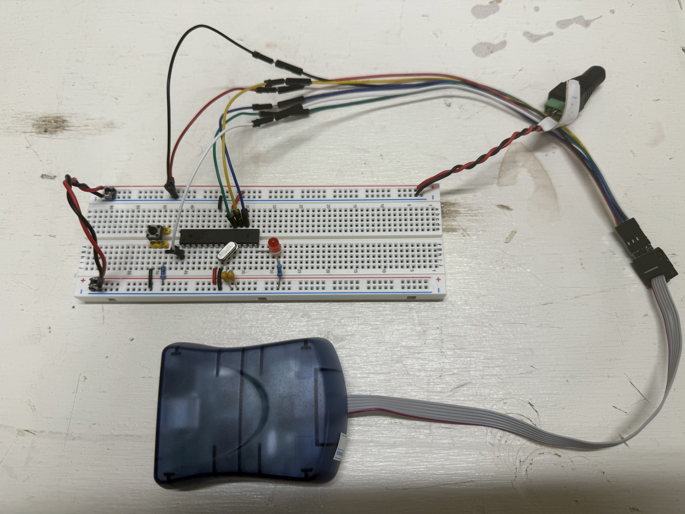

AVR Blink
=========

The "Hello, world" of microcontroller programming is a simple program 
that blinks an LED in a loop. This repository provides such a program 
for an AVR microcontroller (MCU). Using the resources here, along with 
a breadboard, an AVR microcontroller, a suitable programmer, plus some 
other passive components, the aim is to get you from zero to being able 
to compile an AVR program and transfer it to the MCU to run.

In this tutorial, we'll use the AVR C/C++ compiler (`avr-gcc`) along
with a utility known as `avrdude` used to drive the programmer that 
programs the AVR hardware, plus a couple of other utilities. We'll use 
a plain text editor and command-line tools so that you can understand 
the basic flow without getting tangled up in an IDE that hides a lot of
the detail from you.

This tutorial assumes you're using a Linux distribution that uses the 
APT package manager. If you're using some other package manager, I'll
assume you know how to translate `apt` commands and package names to
your package manager of choice.


AVR Programmer
--------------

In order to program an AVR microcontroller (outside of an ecosystem 
such as Arduino) you'll need a programmer. AVR MCUs typically use an 
in-circuit serial programmer (ISP). This type of programmer usually 
has a USB interface for the connection to your workstation, and connects 
to the AVR's SPI interface pins to transfer programming data into the 
MCU's on board flash memory and/or fuses.

There are a few different options for programming an AVR microcontroller, 
but an affordable option that is easy to use is an AVR ISP MkII clone. 
Microchip has moved on to later programmer technology, but the AVR ISP 
MkII was widely cloned and a decent unit can be purchased online for 
about $50 USD. The programmer I used for this tutorial is the 
[Waveshare AVR ISP XPII](https://www.amazon.com/dp/B00ID98C5K).
It's been trouble free and reliable over about four years of use now.


Toolchain
---------

Apart from your editor of choice and `git`, you'll need to install the 
following APT packages.

* gcc-avr
* avr-libc
* avrdude
* make

```shell
sudo apt update
sudo apt install gcc-avr avr-libc avrdude make
```

Hardware
--------

For this tutorial, you'll need an AVR microcontroller. As of this writing, 
the ATmega328P-PU is available from Mouser, Digikey, and other suppliers 
for a unit price of about $3 USD.  This is the same breadboard-friendly 
PDIP-28 package that is used on the Arduino Uno. You could also use any 
of the ATmega48/88/168 MCUs. I completed this tutorial using the ATmega168, 
and then subsequently made minor revisions to the `Makefile` for the 
ATmega328P.

Here's the complete list of components. 

* ATmega328P-PU (or ATmega48/88/168)
* SPST tactile button
* 5 mm or 3 mm LED
* 10K ohm, 1/4W resistor
* 330 ohm, 1/4W resistor
* 18.432 MHz crystal (optional)
* 2x 22 pF ceramic capacitor (optional)
* 100 nF ceramic capacitor

AVR microcontrollers have an onboard 8 MHz internal oscillator. This is 
more than adequate for some projects. However, for projects that move a 
lot of data via the USART, an 18.432 MHz may be a better choice. This 
frequency allows the USART to operate in asynchronous mode at 115,200 
bps or 230,400 bps with no difference between the specified bit rate and 
the rate produced by the baud rate generator (as specified via register
UBRR0). The optional crystal and 22 pF capacitors are used to create 
this external clock source for the MCU.


Circuit Build
-------------

The circuit shown in the following image is available in the file 
[blink.pdf](blink.pdf). Build out the circuit as shown on a good quality 
breadboard. You'll need a +5 VDC power supply to connect to the rails 
of the breadboard. 



The 100 nF decoupling capacitor shown on the schematic can simply 
straddle pins 7 and 8 on the MCU. 


Connecting the Programmer
-------------------------

Jumper J1 in the circuit matches the pinout of the conventional AVR 
ICSP connector. The kit for your programmer will likely include a 
connector that breaks this connector out into individual jumper wires 
with Dupont style connectors on the end. By pushing a short jumper wire 
into the end of the Dupont connector, you can adapt the gender to allow 
connection to the rows of the breadboard as shown in the photo below.



After connecting the jumper wires for the ICSP connector, connect a USB
cable between your workstation and the programmer, then power up the
breadboard. After a few seconds, LEDs visible through the translucent
cover of the programmer should be green. If a red LED persists, check
your circuit and the ICSP connections carefully.


Firmware Build and Transfer
---------------------------

In `blink.c` you'll find a very simple program that toggles the state 
of the MCU's PB0 pin and delays for 500 ms, in a loop.

The `Makefile` includes the commands necessary to build the code and
transfer it into the flash on the chip. If you study the Makefile 
carefully, you'll discover that the process is very similar to compiling
and linking any other C program, with some extra steps to convert the
resulting binary to Intel Hex format, and transfer it to the MCU using
the AVR ICSP programmer.

The default setup in the `Makefile` uses the MCU as it is configured
from the factory. The factory set up uses the MCU's internal oscillator,
and divides that frequency by 8 to get a 1 MHz system clock.

Run this command to build the program, transfer it to the MCU flash, 
and program the lower-order fuse in the MCU to the default settings.

```shell
make clean flash lfuse
```

As the build runs you'll see output similar the following, LEDs inside
the programmer will flash quickly, and then the LED on the breadboard
should begin to flash at about 1 pulse per second.

```
$ make clean flash lfuse
rm -f *.o *.elf *.hex
avr-gcc -Os -mmcu=atmega328p -DF_CPU=1000000 -c blink.c 
avr-gcc  blink.o -o blink.elf
avr-objcopy -O ihex -R .eeprom blink.elf blink.hex
avrdude -p atmega328p -c avrispmkii -U flash:w:blink.hex:i

avrdude: AVR device initialized and ready to accept instructions
avrdude: device signature = 0x1e950f (probably m328p)
avrdude: Note: flash memory has been specified, an erase cycle will be performed.
         To disable this feature, specify the -D option.
avrdude: erasing chip
avrdude: reading input file blink.hex for flash
         with 30 bytes in 1 section within [0, 0x1d]
         using 1 page and 98 pad bytes
avrdude: writing 30 bytes flash ...

Writing | ################################################## | 100% 0.05 s 

avrdude: 30 bytes of flash written
avrdude: verifying flash memory against blink.hex

Reading | ################################################## | 100% 0.04 s 

avrdude: 30 bytes of flash verified

avrdude done.  Thank you.

avrdude -p atmega328p -c avrispmkii -U lfuse:w:0x62:m

avrdude: AVR device initialized and ready to accept instructions
avrdude: device signature = 0x1e950f (probably m328p)
avrdude: reading input file 0x62 for lfuse
         with 1 byte in 1 section within [0, 0]
avrdude: writing 1 byte lfuse ...
avrdude: 1 byte of lfuse written
avrdude: verifying lfuse memory against 0x62
avrdude: 1 byte of lfuse verified

avrdude done.  Thank you.
```


Changing the Clock Frequency and Source
---------------------------------------

If you examine the variables defined in the `Makefile`, you'll find
a set of three possible definitions for `LFUSE_BITS`, two of which
are commented out. These three different choices represent three 
different system clock configurations for the MCU.

* `LFUSE_BITS=0x62` -- this is the factory default configuration
  which divides the internal oscillator's frequency by 8 to get a
  1 MHz system clock
* `LFUSE_BITS=0xe2` -- this selects the 8 MHz internal oscillator as 
  the system clock, but disables the clock divisor
* `LFUSE_BITS=0xef` -- this selects the external crystal (on the XTAL1
  and XTAL2 pins) as the clock source

The `lfuse` target in the Makefile instructs `avrdude` to program the
low-order fuse bits using the selected value.

When changing the system clock configuration, it is important to also
update the `CLOCK` variable definition. This provides the system clock
speed in cycles per second (Hz) to C code (such as the `_delay_ms` 
function used in the sample program) that relies on knowledge of the
clock speed.

After changing the `LFUSE_BITS` value, run the build again using this
command.

```shell
make clean flash lfuse
```

The `lfuse` target is needed only when you wish to change the clock
source and speed. Omitting it from the `make` command line when not 
needed will save some time.


Next Steps
----------

Now, you have a barebones working AVR project board and `Makefile` 
that can build an AVR program and transfer it to the device. Clone
this project and start a new project that you can use to start 
exploring the various peripherals available in the MCU. The official
[megaAVR Data Sheet](https://ww1.microchip.com/downloads/en/DeviceDoc/ATmega48A-PA-88A-PA-168A-PA-328-P-DS-DS40002061A.pdf) is a great place to learn 
about all of the capabilities.

The [AVR-LibC](https://avrdudes.github.io/avr-libc/) project on Github 
has the documentation for the AVR C library. This is the place to discover 
all the functions available in the library, as well as details such as 
how to declare interrupt service routines, how to store and reference 
data in flash with the program, etc.

A good second project is to revise the initial blink project so that
the state of the LED pin is toggled in an interrupt service routine 
triggered by the MCU's Timer0 peripheral. Another good project would
use pulse-width modulation (PWM) to vary the brightness of an LED,
to create a "breathing" effect.

Happy hacking!

END
